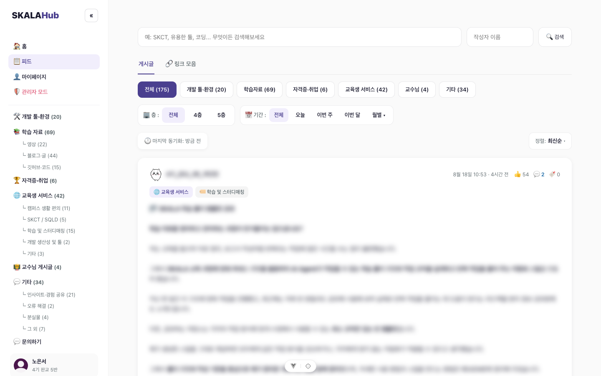
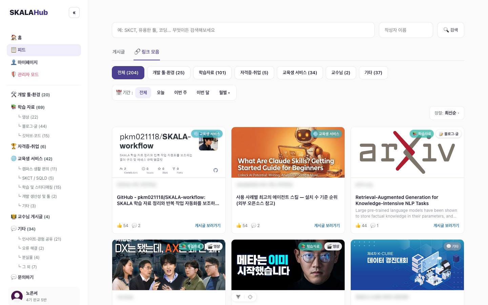
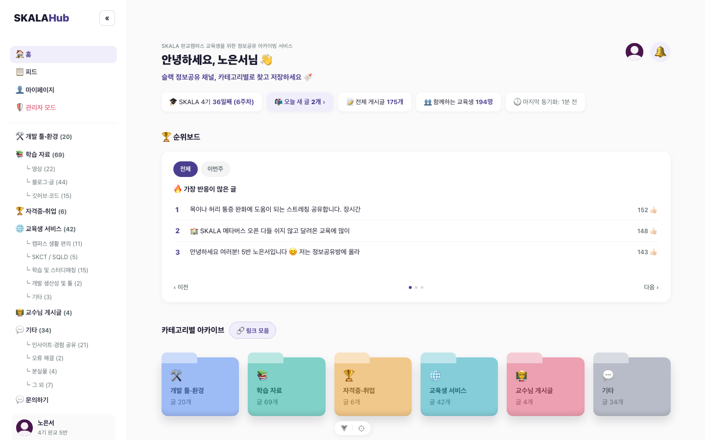
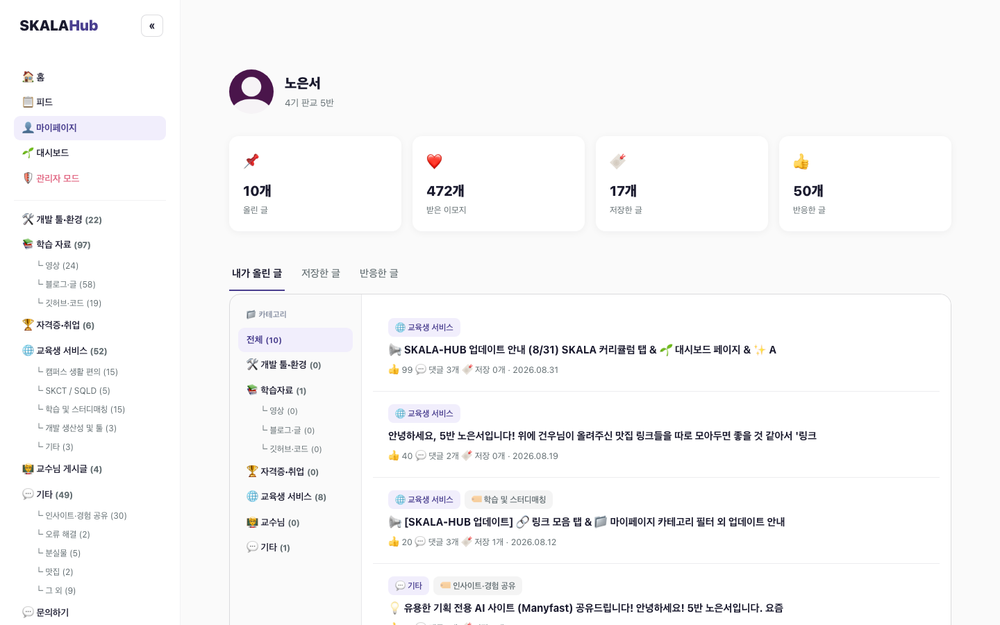
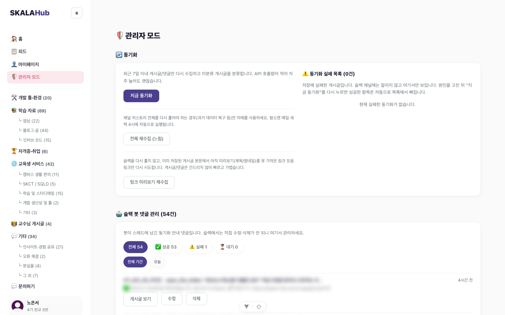

# SKALA Hub

**340명의 정보가 흘러가 버리는 슬랙 채널을, 검색되고 쌓이는 아카이브로.**

SKALA 부트캠프 교육생들이 슬랙에 매일 쏟아내는 꿀팁·자료·후기를 자동으로 수집·분류해서, 다시 찾아볼 수 있는 피드로 정리하는 서비스입니다.

---

## 왜 만들었나

SKALA 정보공유 슬랙 채널은 하루에도 수십 개의 글이 올라오지만, 시간이 지나면 스크롤 아래로 묻혀 사실상 다시 찾기 어려운 정보가 됩니다. **SKALA Hub는 이 채널을 실시간으로 아카이빙하고, 카테고리·태그로 자동 분류해서 필요할 때 검색해서 꺼내 쓸 수 있게 만든 서비스**입니다. 기획부터 디자인, 프론트엔드, 백엔드, 배포까지 1인 바이브코딩으로 개발했습니다.

## 핵심 기능

### 슬랙 원문 그대로, 놓치는 것 없이

텍스트 이모지, 인라인 코드, 코드 블록, 링크 미리보기, 이미지/GIF, 파일 첨부까지 — 슬랙에서 보던 그대로의 느낌으로 피드에서 다시 볼 수 있습니다. 카테고리·태그 필터, 캠퍼스·기간별 필터, 키워드 검색·정렬도 지원합니다.

### 링크만 따로 모아보기

게시글 속에 흩어진 GitHub 저장소, 아티클, 영상 링크를 한 곳에 모아 카드로 보여줍니다. 같은 링크가 여러 번 공유됐으면 하나로 합쳐서 정리합니다.

### 홈 대시보드

오늘 올라온 글, 전체 게시글 수, 함께하는 교육생 수, 가장 반응이 많은 글 순위보드를 한눈에 보여줍니다.

### 마이페이지

내가 저장한 글·직접 올린 글·반응을 남긴 글을 모아보고, 받은 이모지·저장 수 같은 활동 통계도 확인할 수 있습니다.

### 관리자 모드

AI(Claude Haiku)가 자동 분류하지 못한 게시글을 일괄 처리하고, 카테고리·태그·고정 여부를 수동으로 수정하고, 슬랙 봇이 남긴 동기화 댓글을 관리할 수 있습니다.

### 슬랙 봇 자동 동기화

새 글이 올라오면 실시간으로 수집해 자동 분류하고, 원본 슬랙 스레드에 봇이 "SKALA-Hub에 동기화되었습니다" 댓글과 바로가기 링크를 남깁니다. 이후 30분 주기로 반응·댓글 수도 최신 상태로 갱신합니다.

*(스크린샷 추가 예정)*

### 그 외

- **알림 & 문의하기** — 공지사항 알림과 읽음 처리, 문의 접수 및 관리자 응답
- **AI 카테고리 분류** — Claude Haiku API로 개발 도구·학습 자료·자격증/취업·교육생 서비스·교수님·기타 6개 카테고리 자동 분류

## 기술 스택

| 영역 | 스택 |
|---|---|
| 프론트엔드 | Vue.js 3 (Vite + Pinia + Vue Router 4) → Vercel 배포 |
| 백엔드 | Spring Boot 4 (Java 21) → Render 배포 (Docker) |
| DB | Supabase (PostgreSQL) |
| AI 분류 | Claude Haiku API |
| 인증 | Slack OAuth + JWT |

## 성과

- 🚀 **배포 1시간 만에 이용자 100명 달성**
- 👥 **2026.08.18 기준, SKALA 4기 340명 중 194명이 이용 중**

