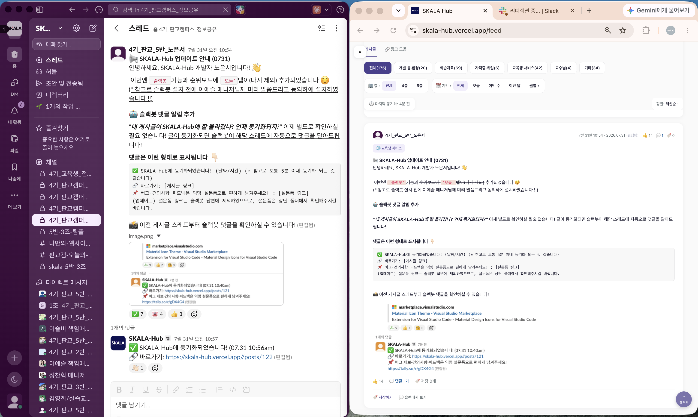
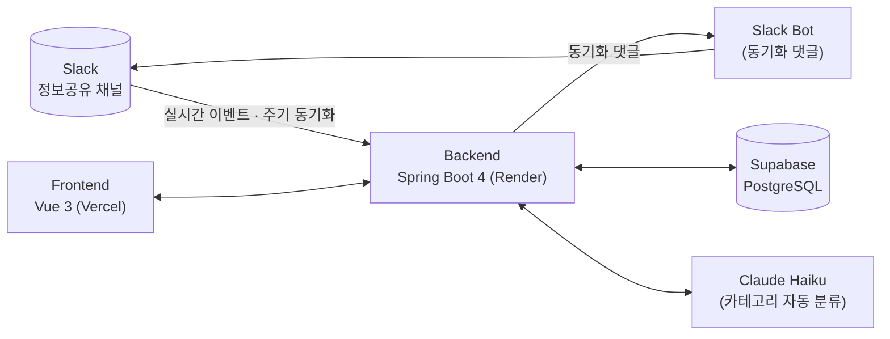

# SKALA Hub

**340명의 정보가 흘러가 버리는 슬랙 채널을, 검색되고 쌓이는 아카이브로.**

슬랙 채널에 올리는 인사이트·자료·웹사이트를 자동으로 수집·분류해서,다시 찾아볼 수 있는 피드로 정리하는 서비스입니다.

 

## 🏆 성과

- 🚀 **배포 1시간 만에 이용자 100명 달성**
- 👥 **2026.08.18 기준, SKALA 4기 340명 중 194명이 이용 중**

## 💡 배경

SKALA 정보공유 슬랙 채널은 하루에도 수십 개의 글이 올라오지만, 시간이 지나면 스크롤 아래로 묻혀 사실상 다시 찾기 어려운 정보가 됩니다. **SKALA Hub는 이 채널을 실시간으로 아카이빙하고, 카테고리·태그로 자동 분류해서 필요할 때 검색해서 꺼내 쓸 수 있게 만든 서비스**입니다. 기획부터 디자인, 프론트엔드, 백엔드, 배포까지 1인 바이브코딩으로 개발했습니다.

## ✨ 핵심 기능

<table>
<tr>
<td width="50%">

**🗂️ 피드**

슬랙 원문의 이모지·코드·링크 미리보기·이미지를 그대로 재현하고, 카테고리·태그·기간으로 필터링·검색합니다.

</td>
<td width="50%">

**🔗 링크 모음**

게시글에 흩어진 GitHub·아티클·영상 링크를 하나의 카드로 모아, 중복 없이 정리해서 보여줍니다.

</td>
</tr>
<tr>
<td width="50%">

**🏠 홈 대시보드**

오늘의 새 글, 전체 게시글 수, 참여 인원, 인기 게시글 순위를 한눈에 보여줍니다.

</td>
<td width="50%">

**👤 마이페이지**

내가 저장·작성·반응한 글을 모아보고, 받은 이모지·저장 수 같은 활동 통계를 확인합니다.

</td>
</tr>
<tr>
<td width="50%">

**🛡️ 관리자 모드**

미분류 게시글을 일괄 분류하고, 카테고리·태그·고정 여부를 수정하고, 슬랙 봇 댓글을 관리합니다.

</td>
<td width="50%">

**🤖 슬랙 봇 동기화**

새 글을 실시간으로 수집·분류하고, 원본 슬랙 스레드에 동기화 완료 댓글과 바로가기 링크를 남깁니다.

</td>
</tr>
</table>

그 외에도 **공지 알림·문의하기**, **Claude Haiku 기반 자동 카테고리 분류**(개발 도구·학습 자료·자격증/취업·교육생 서비스·교수님·기타 6개) 기능을 제공합니다.

## 🏗️ 아키텍처

